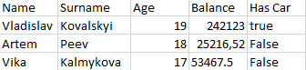

# Example

## .CSV file


## Output
```json
{
  "1": {
    "Name": "Vladislav",
    "Surname": "Kovalskyi",
    "Age": 19,
    "Balance": 242123,
    "Has Car": true
  },
  "2": {
    "Name": "Artem",
    "Surname": "Peev",
    "Age": 18,
    "Balance": 25216.52,
    "Has Car": false
  },
  "3": {
    "Name": "Vika",
    "Surname": "Kalmykova",
    "Age": 17,
    "Balance": 53467.5,
    "Has Car": false
  }
}
```